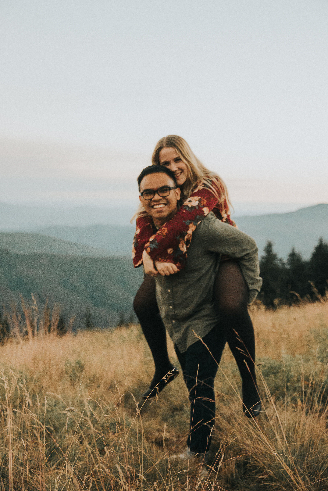
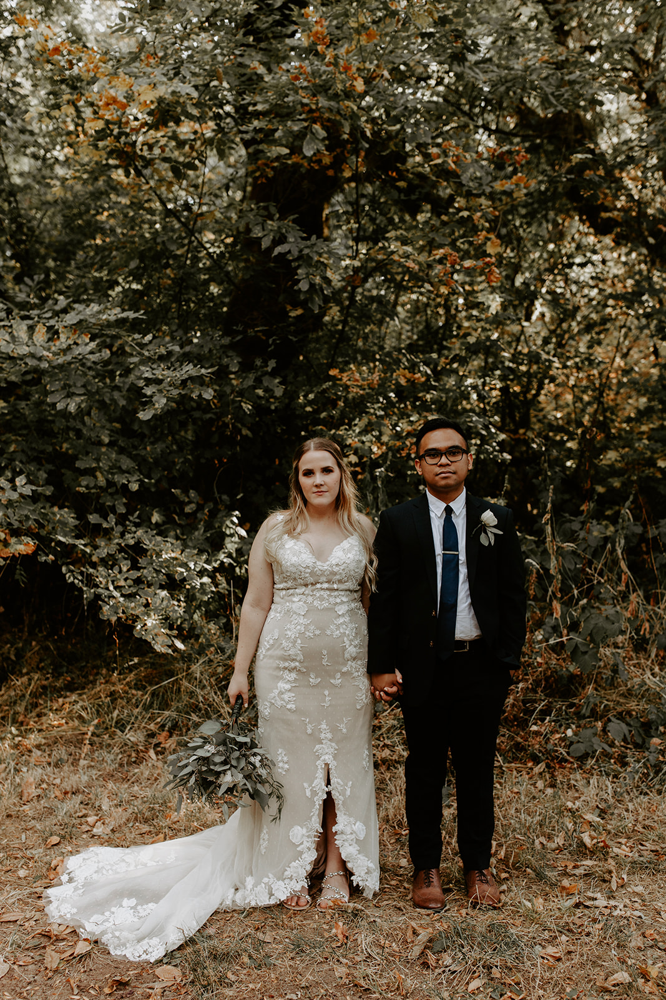

<!DOCTYPE html>
<html lang = “en”>
<head>
 <meta charset = “UTF-8”>
	<title>Our Story</title>
	
	<link rel="stylesheet" href="photostyle.css">
	<link href='https://fonts.googleapis.com/css?family=Jost' rel='stylesheet'>
</head>
<body>
	<h1>Our Photos</h1>
	<table>
		<thead>
			<th scope="col">Engagement</th>
			<th scope="col">Mary's Peak</th>
			<th scope="col">Wedding</th>
		</thead>
		<tr>
			<td></td>
			<td></td>
			<td></td>
		</tr>
	</table>
	<button onclick="message()">Guess our Anniversary!</button>
	

		Hover over an image to see details!
	

</body>
